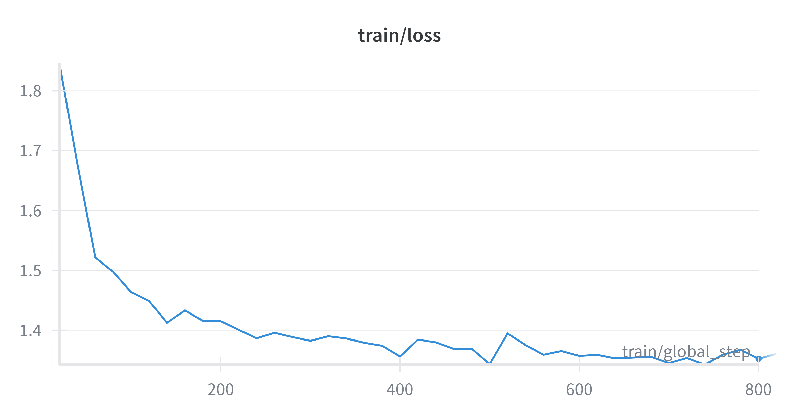

# 🌍 Euro Machine Translation (WIP)

-lightgrey?style=flat-square)

Reproducible MT experiments with a **compact LLM** under limited compute.  
I fine-tune **Qwen2.5-3B** (base) for **German → English** translation using instruction-style SFT, with a plan to explore **GRPO** (RL) and then extend to other European languages.

- **Phase 1:** Instruction-style **SFT** baseline.  
- **Phase 2:** **GRPO** (RL) with COMET rewards to push quality.  
- **Phase 3:** Extend to additional European language pairs.

---

## 🎯 Goals

- **Model:** `unsloth/Qwen2.5-3B` with **QLoRA 4-bit** (Colab-friendly).
- **Data:** WMT14 **DE↔EN** (start with DE→EN), standard and comparable.
- **Method:** Build a solid **SFT baseline** → add **GRPO** with automatic rewards.
- **Constraints:** Consumer GPUs and reasonable wall-time.

---

## ✅ Implemented

### Preprocessing (WMT14 → filtered dataset on Drive)

**Sampling**
- Load `wmt14 de-en` via 🤗 `datasets`. Sample **150k** training pairs (compute-friendly).  
  Validation/test are the **original WMT14 splits**.

**Token length analysis**
- Inspect token length distributions for **source**, **target**, and **src+tgt** across splits to pick a safe `max_seq_length` and spot outliers.

**Language ID**
- Use `fasttext==0.9.2` (HF weights: `facebook/fasttext-language-identification`) for Language identification.  
- Add **`LID_src` / `LID_tgt`** with model confidence for German/English; plot % of pairs with correct languages across confidence thresholds **0.90–0.99**.  
- Use this to drop pairs with wrong language assignment.

**Length ratio analysis**
- Check counts across ranges of ratio between length of source and length of translation (`len_src/len_tgt`) (e.g., `0.5–2.0`, `0.33–3.0`, `1/2.25–2.25`).  
- Filter out pairs with extreme length mismatch (often low-quality alignments).

**Quality Estimation (reference-free)**
- Compute **COMETKIWI-22** and store as **`cometkiwi22`** for all pairs; keep only high-quality data.

**Filtering (train/val only)**
- Thresholds used:
  - `len_src + len_tgt ≤ 169`
  - `LID_src ≥ 0.95` **and** `LID_tgt ≥ 0.95`
  - `len_src/len_tgt ∈ [1/2.25, 2.25]`
  - `cometkiwi22 ≥ 0.60`
- **Test** remains **untouched** for fair evaluation.

---

### Fine-tuning (SFT with Unsloth + TRL)

**Model & LoRA**
- Load `unsloth/Qwen2.5-3B` with `load_in_4bit=True`.  
- LoRA: `r=16`, `lora_alpha=16`, `lora_dropout=0.05`, `bias="none"`, **target_modules**:  
  `["q_proj","k_proj","v_proj","o_proj","gate_proj","up_proj","down_proj"]`.

**Data formatting (ChatML, Qwen 2.5)**
- `get_chat_template(..., "qwen-2.5")` to build per-example messages:
  - `system`: _“You are a translation engine. Translate from German (de) to English (en).”_
  - `user` = source
  - `assistant` = target  
- Use Qwen special tokens to delimit roles: `<|im_start|>`, `<|im_end|>`.  
- **Train loss only on responses** via `train_on_responses_only` with:
  - `instruction_part = "<|im_start|>system\n"`
  - `response_part    = "<|im_start|>assistant\n"`

**Training (TRL `SFTTrainer`)**
- **Batching:** `per_device_train_batch_size = 128`, `gradient_accumulation_steps = 1`, `num_train_epochs = 2`.
- **Optim & schedule:** `adamw_8bit`, `lr=1e-4`, `cosine`, `warmup_ratio=0.05`, `weight_decay=0.01`, `max_grad_norm=0.6`.
- **Eval/Save:** `eval_steps=150–200` (used `150`/`200` in runs), `save_steps=150–200`, `save_total_limit=3`,  
  `metric_for_best_model="eval_loss"`, `load_best_model_at_end=True`, **early stopping** (patience=3).
- **Precision:** `bf16` on A100, else `fp16` if available.
- **Tracking:** Weights & Biases.  
- **Outputs:** local `outputs_sft/` → copy **best/last** to Drive.
- ### 📉 Training loss

  

**Generation + Evaluation (TEST)**
- Reload base + **LoRA adapters** from Drive.
- Generate translations on TEST with the same ChatML **system→user→assistant** pattern and robust stopping.  
- Evaluate with **COMET `wmt22-da`** (reference-based) on TEST.

---

## 🧰 Stack & Versions

**Preprocessing**
- `datasets` (🤗)
- `transformers`
- `tiktoken`
- `fasttext==0.9.2` **(requires `numpy<2.0.0`)**
- `huggingface_hub`
- `unbabel-comet>=2.2.4,<3.0.0`

**Fine-tuning**
- `unsloth`, `bitsandbytes`, `accelerate`, `peft`, `trl`, `transformers`, `sentencepiece`, `protobuf`, `hf_transfer`
- **Weights & Biases** for tracking

> Pin exact versions if you need strict reproducibility for your environment.

---

## 📂 Repository Layout

├─ de-en_qwen_preprocessing.ipynb # WMT14 → sample(150k) → lengths → LID → COMETKIWI-22 → filters
└─ de-en_qwen_SFT.ipynb # Unsloth QLoRA (Qwen2.5-3B) + TRL SFT + generation/eval

---

## 🚀 Quickstart (Colab)

### 1) Preprocessing
1. Open `de-en_qwen_preprocessing.ipynb`, run top-to-bottom.  
2. For **COMETKIWI-22**, use an **HF token** (gated repo).  
3. Verify Drive paths. You’ll get **filtered train/val** and **raw test** on Drive.

### 2) SFT
1. Open `de-en_qwen_SFT.ipynb`, mount Drive.  
2. Point `SAVE_DIR` to the **filtered** dataset path.  
3. (Optional) Provide your **W&B API key** when prompted.  
4. Train; best/last checkpoints are copied to Drive and printed.

### 3) Generation + COMET
1. Set `CKPT_DIR` to the saved checkpoint on Drive.  
2. Run generation (ChatML; robust EOS) on TEST.  
3. Evaluate with **COMET `wmt22-da`**; save system/segment scores alongside the CSV.

---

## 📈 Current Results

| Split | Metric                      |   Value   |
|-----:|:----------------------------|:---------:|
| test | COMET `wmt22-da` (system)   |  0.842133 |

This is the current result for Qwen2.5-3B SFT on WMT14 DE→EN.  
Next steps: assess whether **GRPO** can further improve quality, then **extend to multiple languages**.

---

> This repository is a **work in progress**. Results, configs, and best practices will evolve as experiments progress.
